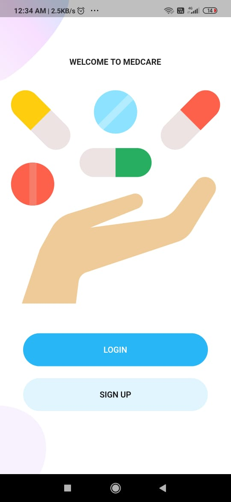
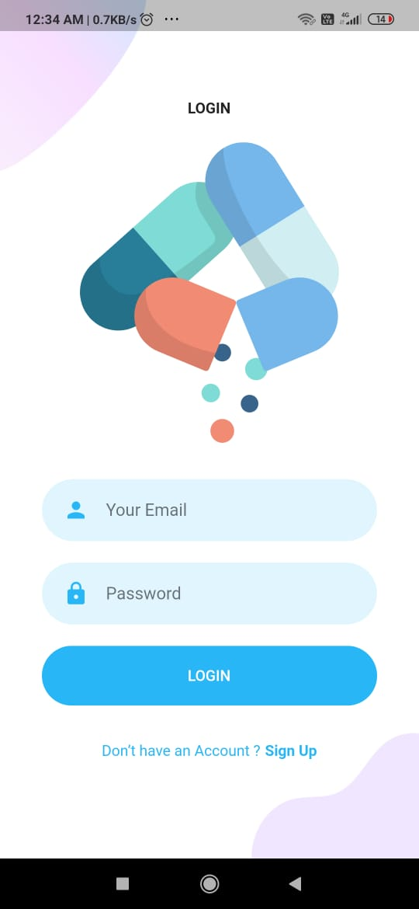
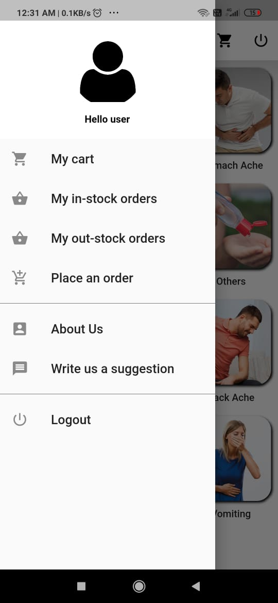

# MedCare

An E-commerce flutter application for medicines...
Features-
1) Add medicines according to their categories.
2) View and search medicines according to their categories.
3) User can add items to their cart.
4) User can order any medicine.
5) User can also place an order.
6) Payment Gateway integrated using RazorPay API.
7) Database-Firebase Firestore.
8) Cloud Storage- Firebase Storage.
9) User authentication- Firebase Authentication

## Welcome Screen

## SignUp Screen

## Login Screen

## Dashboard Screen

## Drawer Screen

## Medicine List Screen

## Search Medicine Screen

